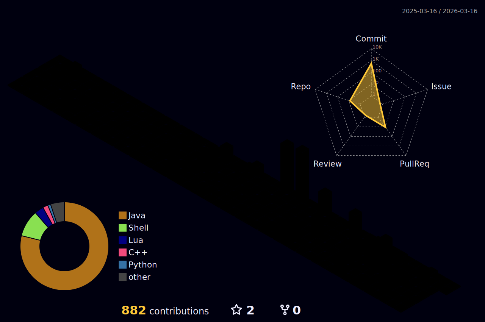

## Hi, I’m Othmane 👋

**Name:** Othmane
**Pronouns:** He/Him
**Location:** Ottawa, Canada

I’m a software developer and tinkerer.

I work on projects across Python, Java, and Lua, building both small utilities and full applications.
Software developer focused on systems engineering, automation, and backend architecture.

I build projects that prioritize real-world execution, architectural clarity, and understanding how systems work under the hood:

* **Autonomous Development Agent** – Architecting an AI-driven agent that parses structured GitHub issues, generates scoped implementation plans, and automates development workflows with validation safeguards and modular control flow.

* **AutoHomelab** – Infrastructure automation project for provisioning and managing reproducible homelab environments using production-style patterns.

* **uTasteApp (Java)** – Application project demonstrating object-oriented design, structured architecture, and separation of concerns in a full application context.

* **Password Manager (Java)** – Secure data-handling application emphasizing clean architecture and encapsulation.

* **Neovim Configuration (Lua)** – Modular, maintainable development environment optimized for productivity.

---

### Engineering Focus

* Backend & systems development
* AI-assisted automation
* Infrastructure & reproducibility
* Clean, modular architecture

Interested in backend, infrastructure, and AI-systems roles where reliability, architecture, and automation matter.

---

